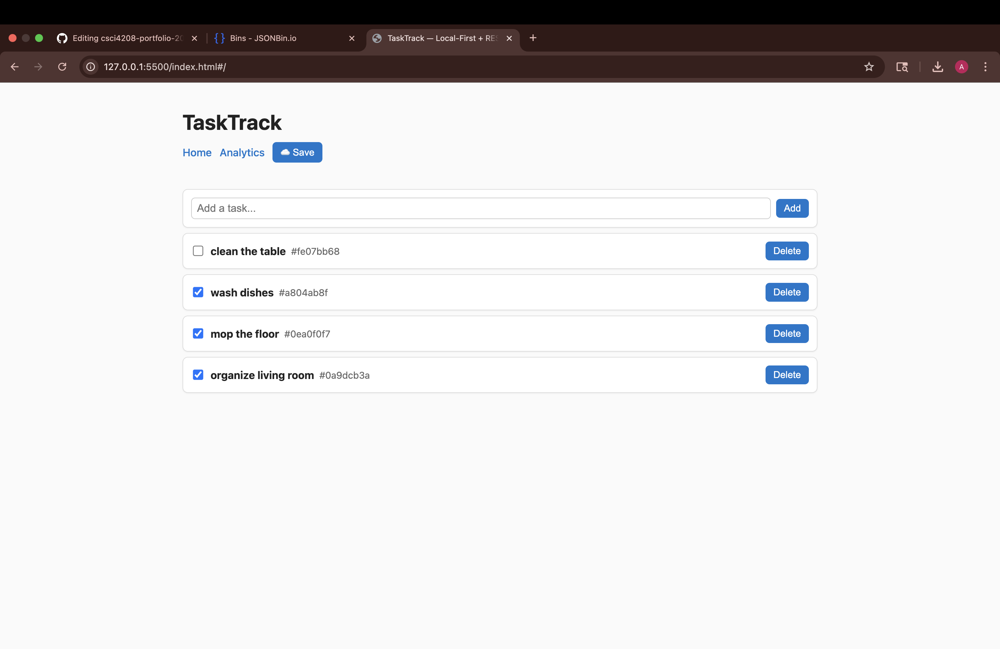
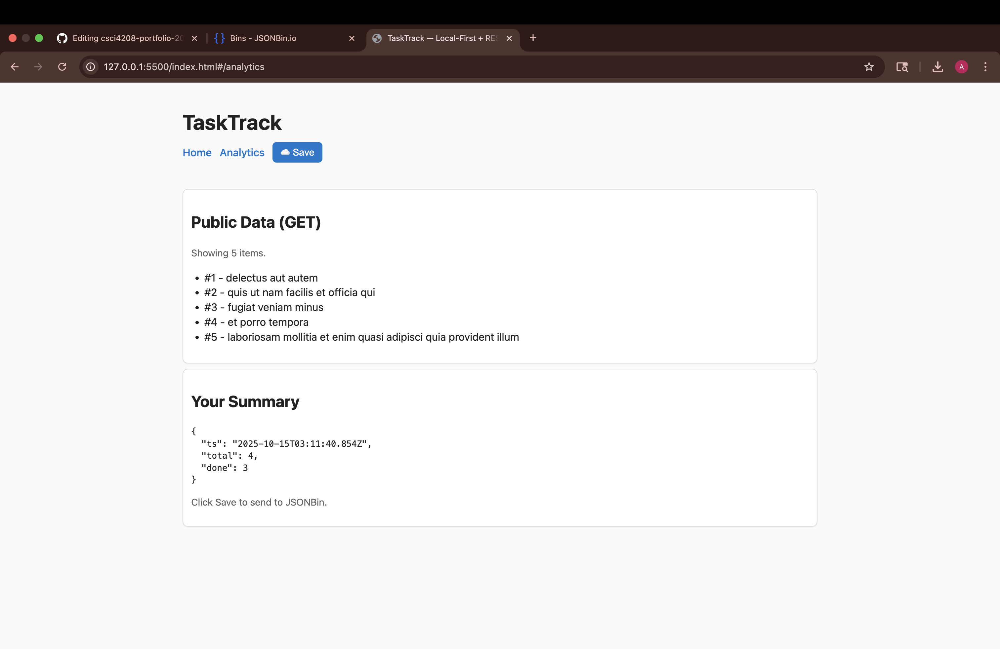

# TaskTrack — Local-First Task Manager (SPA)

A lightweight, offline-friendly task tracker. Add and complete tasks directly in the browser; your data persists locally. An analytics view shows totals and can save a small summary to a public JSONBin.

## Features
- Add, complete, and delete tasks
- Autosave to `localStorage`; restores on relaunch (works offline)
- Analytics view with quick summary (total vs. done)
- Public GET (sample data) with 30-minute TTL cache
- One-click cloud save: writes a small, non-sensitive summary to JSONBin

## Screenshots / Demo
- 
- 
- Demo video (60–120s): <[https://drive.google.com/file/d/1JWMdyuPVmKM_6jyz31GAl0WOgMn8y7ZQ/view?usp=sharing]>

## Live Demo / Install & Run
- **Live demo (GitHub Pages):** https://<avazquezmaldonado>.github.io/<csci4208-portfolio-2025>/
  - (SPA uses hash routing so deep links work.)
- **Local run (fallback):**
  1. Open the folder in VS Code
  2. Use the “Live Server” extension or run `npx http-server .`
- **Requirements:** Designed for 1280×720+; tested on Chrome and Edge.

## How It Works (High-Level)
- **Rendering stack:** DOM/Components (Vanilla). Simple reusable components and views; no external framework.
- **Architecture in brief:**
  - `Store` (class) manages task state and persistence
  - Views (`HomeView`, `AnalyticsView`) render UI from state
  - `Router` switches views via URL hash (`#/` and `#/analytics`)
  - Components: `TaskForm`, `TaskList` handle user interaction
- **Local-first behavior:** All tasks are saved to `localStorage` on change. When reopened, the app restores tasks before any network calls.

## Data & Networking (High-Level)
- **Public GET (cached 30 min):**  
  Endpoint — `https://jsonplaceholder.typicode.com/todos?_limit=5`  
  Example response:
  ```json
  [
    { "userId": 1, "id": 1, "title": "delectus aut autem", "completed": false },
    ...
  ]

## License / Credits

This project was developed as part of **CSCI 4208 – Web Applications** at the **University of New Orleans**.  
All code and assets are for educational use only.

**Assets and libraries used:**
- [MVP.css](https://andybrewer.github.io/mvp/) for minimalist styling  
- [JSONBin.io](https://jsonbin.io) for REST storage and testing  
- Vanilla JavaScript (ES Modules), HTML, and CSS

© 2025 Angel Vazquez. All rights reserved.

---

## Developer Docs / Links

- [docs/architecture_sketch.md](./docs/architecture_sketch.md)  
- [docs/endpoints.md](./docs/endpoints.md)  
- [docs/jsonbin_schema.md](./docs/jsonbin_schema.md)  
- [docs/roadmap.md](./docs/roadmap.md)  
- [docs/pitch.md](./docs/pitch.md)  
- [docs/dod-sprint1.md](./docs/dod-sprint1.md)  
- [docs/dod-sprint2.md](./docs/dod-sprint2.md)  
- [docs/dod-sprint3.md](./docs/dod-sprint3.md)
